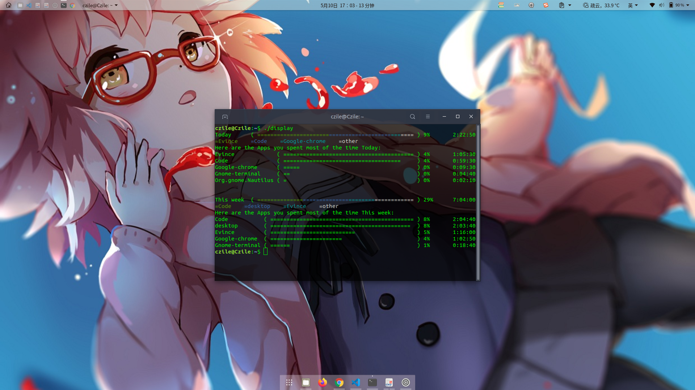

# Timespent
A time usage statistics tool on Linux platform, which can display:
1. Statistics of computer use time since today and in the past week.
2. Count the usage time of each application today and in the past week.

[中文版本](README.md)

## Screenshot

## Feature
- [x] print the data in an easy way.

- [x] para `-h`          : print the infomation of help

- [x] para `-d` `--day`  : print the data of specified day

- [x] para `-i` `--in`   : print the data in the past several days

- [x] para `-f` `--from` : print the data since specified number of days

- [x] para `-g`          : print all the programs instead of top 5 programs

- [x] para `-p` `--program`: Only print the specified program's data

- [ ] Set time goal and time control

- [ ] print the data in different hours(or mins)

- [ ] error handling mechanism

- [ ] package the program as gnome extension

## Usage
1. Set the program `dist/getWindows` open automatically at boot
2. Move the program `dist/display` to your directory `~` (this is to say, Input `mv dist/display ~` in terminal)
3. Reboot
4. Type `./display` in terminal to start

## Remarks
`getWindows` is a program that get the windows name that is focused every 10s, and save the data in `~/.timespent/{time}.csv`. It exists thanks to pyinstaller. `display` can read the data, and print the data in terminal using an easy way. The source code in the folder `src`.

## LICENSE
GPL 3.0 or later.